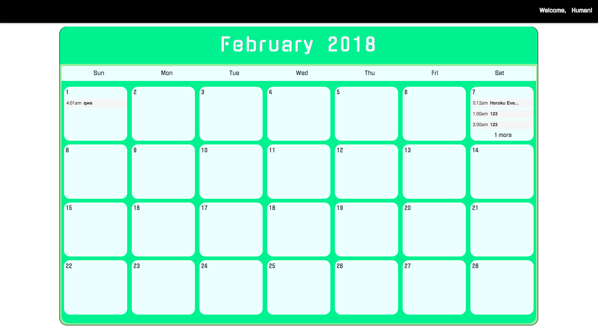

- Algorithms questions are in the algorithms directory...
---
## Introduction
- This app is a calendar and was created using React.js, Node.js, Javascript, CSS, PSQL, and Materialize CSS. 
- You can add the start & end time, plus the description of the event into the calendar by clicking on the days (boxes). 
- You can see the whole day's events view to see the full descriptions of the event(s) and delete as well by clicking on either "more" or on the event itself. 

## Instructions
- `npm install` in both `CalendarBackEnd` & `CalendarFrontEnd` to install all the dependencies in React/Node App.
- `npm start` in both directories to start the both servers (React/Node).
- "Backend" - `http://localhost:3001/events`
- "Frontend - "`http://localhost:3000/`

### Heroku Deployed - https://ttpcalendar.herokuapp.com/

#### This is how it looks

